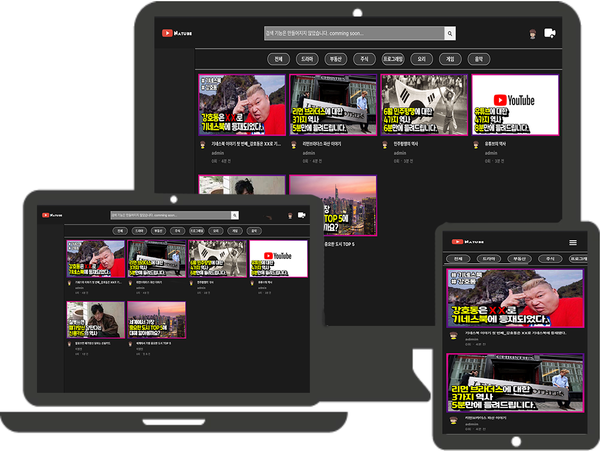
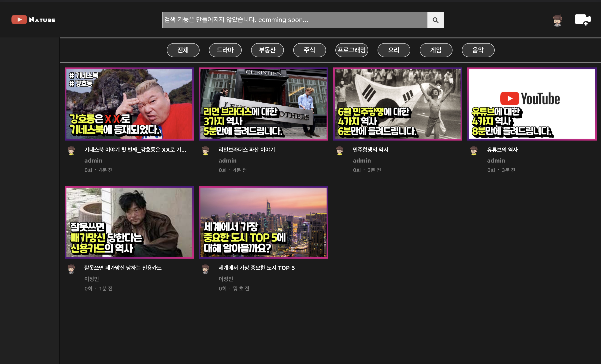
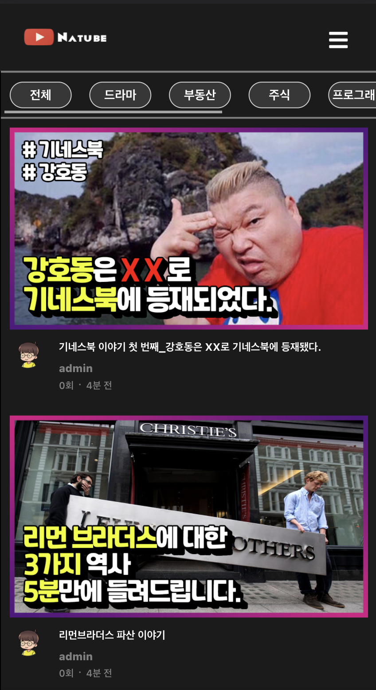

## <u>[비디오 스트리밍 사이트 Natube_0.01v](https://natube-frontend-portfolio.vercel.app/)</u>

---

  

- 세계 최대 비디오 스트리밍 사이트 Youtube를 클론코딩 해본 것이 아닌
  아무것도 모르는 상태에서 <u>[주식 계산기 사이트](https://stock-calculator.vercel.app/stockavarage)</u> 하나만 만들어본 뒤
  맨 땅에 헤딩으로 도전한 포트폴리오입니다.

---

#### 1. 실행화면

###### 
<u>[포트폴리오 홈페이지로 이동하기 ( 클릭! )](https://natube-frontend-portfolio.vercel.app/)</u>

 

---

#### 2. 사용 기술 및 라이브러리

  

 

<!-- 라이브러리 -->

---

#### 3. 포트폴리오 설명

- 아무것도 모를 땐 만들어 보고 싶은 것을 만들어보는 것이 가장 공부에 도움이 된다 생각하여
  만들어 본 두 번째 프로젝트입니다.
   

##### 3-1. Home

- Home에서는, 서버에 요청을 해서 조회수가 높은 순으로 정렬을 한 데이터를 클라이언트에 보내줘서
  클라이언트에서 썸네일 및 영상 정보들을 렌더링합니다.
   

- css와 html 기본을 모르고 시작했을 때엔, flex 속성만을 사용했었다가
  반응형으로 만들려고 하니 브라우저의 크기에 따라 간격이 이상해지는 것을 느낀 후
  포트폴리오 페이지를 만들면서 html과 css의 기본을 차근차근 익힌 뒤,
  flex 속성이 아닌 grid 속성을 사용해서, 브라우저가 작아지더라도 frection만 변경되고
  각 아이템의 배치가 어색하지 않게 변경했습니다.
   

### 
[ PC View ]

 

### 
[ Mobile View ]

 

##### 3-2. Upload Page

- 업로드 페이지는 간단하게, antd에서 제공하는 Upload Dragger를 사용해서 PC버전에서는
  드래그 앤 드롭해서도 파일을 업로드 할 수 있게 만들었습니다.
  또한 로그인을 하지 않아도 업로드가 가능하게 만들었습니다.
   

- 영상 파일인지 이미지 파일인지를 체크해서, 비디오 업로드란은 비디오만
  썸네일 업로드란은 이미지만 업로드가 가능하게 만들었습니다.
   

- 그 외에 제목 / 영상 설명 / 태그 / 닉네임을 입력하거나 선택하는 공간을 만들었고
  닉네임은, 로그인을 했을 경우에는 해당 아이디의 닉네임이 입력되고 수정할 수 없지만,
  로그인을 하지 않았을 경우에는 닉네임을 입력하게 만들었고 6개란에 빈값이 들어있다면
  빈 값이 존재한다는 메시지를 띄웁니다.
   

##### 3-3. SignIn View

- 영상 업로드란 옆 아이콘을 클릭하면, 모달창으로 간단하게 Login을 할 수 있게 만들었습니다.
   

- 회원가입 버튼을 누르면, 회원가입 페이지로 이동을 하게 되고
  아이디는 이메일 형식으로만 입력할 수 있게 만들었습니다.
   

- 로그인을 했을 경우, Natube 아이콘이 아닌, 설정해놓은 프로필 이미지가 보이게 됩니다.
   

##### 3-4. Video Play View

- 영상을 클릭하면, 해당 영상의 아이디를 이용해서 영상에 대한 정보를 서버에서 받아옵니다.
  받아온 영상은 autoplay 설정이 되어서 자동으로 영상이 재생이 되고, 조회수가 1씩 더해집니다.
   

- 영상 제목 / 조회수 / 업로드 된 날짜 / 프로필 / 닉네임 / 영상 설명을 랜더링하고
  좋아요와 싫어요는 개발하지 않았으며, 공유버튼을 눌렀을 땐 공유버튼을 클릭하면
  영상이 재생되고 있는 url을 복사하게 됩니다.
   

- PC화면은 오른쪽 사이드, 모바일화면은 영상 설명 밑 부분에 추천 영상이 나오게 됩니다.
  추천 영상은 해당 영상과 같은 태그를 가진 영상으로 구분이 되어 보여줍니다.
  또한 Home쪽과 마찬가지로 조회수가 높은 순으로 정렬이 됩니다.
   

##### 3-5. SignUp View

- 유저 아이콘을 클릭하면 프로필을 업로드할 수 있으며, 이미지만 업로드 할 수 있게 만들었습니다.
   

- 아이디와 패스워드 / 패스워드 확인 / 닉네임만 간단하게 입력해서 회원기입을 할 수 있게 만들었고
  1차로 빈값이 있는 지 없는 지를 먼저 체크한 뒤 아이디가 이메일 형식이 아니거나
  패스워드와 패스워드 확인 부분이 맞지 않는 지를 체크하고
  닉네임과 아이디가 중복이 되지 않는 지를 서버에서 체크한 뒤 보내오는 데이터에 따라
  회원가입이 완료가 되거나 아이디가 중복인 지 닉네임이 중복인 지를 알려주는 메시지를 띄워줍니다.
   

---

#### 4. 개발하지 못한 기능 / 보완된 기능

##### 개발하지 못한 기능들

- 태그를 클릭하면, 해당 태그들에 맞는 영상들만 보여주는 기능
- 검색 기능
- 좋아요, 싫어요 기능
- 댓글 기능
- 채널 페이지
- AWS S3 클라우드 서버 사용
   

##### 보완된 기능

- ~~flex 속성이 아닌 grid 속성을 사용해서 옆에 여백이 크게 비어있지 않게 수정~~
- ~~sharp라는 라이브러리를 서버에서 사용해서 이미지를 리사이징하게 수정~~
- ~~새로고침 했을 경우, 조회수가 늘어나지 않게 수정~~

---

### 
포트폴리오에 대한 내용을 마치도록 하겠습니다.  모든 내용을 봐주셔서 감사합니다.

# 
Thank You!!

